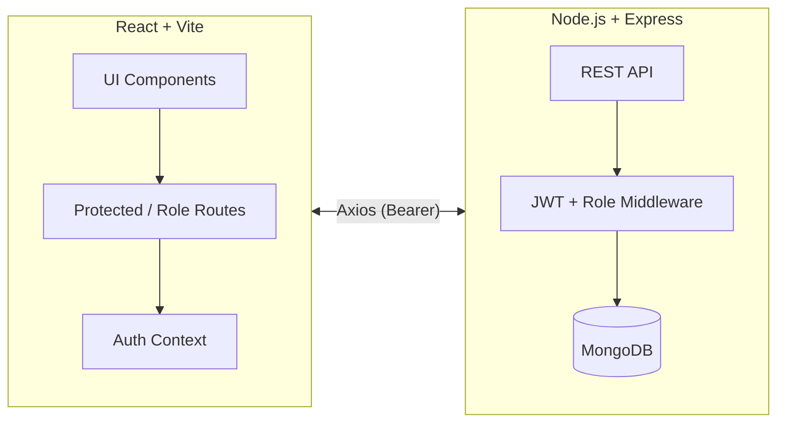

# Hostel Hub

```
██╗  ██╗ ██████╗ ███████╗████████╗███████╗██╗     ██╗  ██╗██╗   ██╗██████╗ 
██║  ██║██╔═══██╗██╔════╝╚══██╔══╝██╔════╝██║     ██║  ██║██║   ██║██╔══██╗
███████║██║   ██║███████╗   ██║   █████╗  ██║     ███████║██║   ██║██████╔╝
██╔══██║██║   ██║╚════██║   ██║   ██╔══╝  ██║     ██╔══██║██║   ██║██╔══██╗
██║  ██║╚██████╔╝███████║   ██║   ███████╗███████╗██║  ██║╚██████╔╝██║  ██║
╚═╝  ╚═╝ ╚═════╝ ╚══════╝   ╚═╝   ╚══════╝╚══════╝╚═╝  ╚═╝ ╚═════╝ ╚═╝  ╚═╝
```

Full-stack hostel management built for a college student’s final-year presentation—my second client website. Polished UX, clear role flows, and easy-to-run demo paths.

---

## At a glance
- Admin, Warden, Student dashboards with protected routing
- Room allocation, attendance, notices, daily menu, and complaints lifecycle
- Read-only profile overviews per role (approval-aware)
- Built to demo fast: clear seed flows for each persona

## Visual architecture


## Tech stack
- Frontend: React (Vite), utility-first styling
- State/Auth: React Context, protected and role routes
- HTTP: Axios with bearer token interceptor
- Backend: Node.js, Express, MongoDB (Mongoose)
- Auth: JWT with role claims and middleware guards

## Project layout
```
backend/    Express API, routes, controllers, models
frontend/   React UI, layouts, pages, components, hooks
```

## Run it locally
1) Install dependencies
```
cd backend && npm install
cd ../frontend && npm install
```

2) Configure environment
- Backend: `backend/.env` with `MONGO_URI` and `JWT_SECRET`.
- Frontend: `frontend/.env` with `VITE_API_URL` (defaults to `http://localhost:3000/api`).

3) Start servers (two terminals)
```
# backend
cd backend
npm run dev

# frontend
cd frontend
npm run dev
```
Frontend: Vite dev server (5173). Backend: 3000.

## API quick tour
- POST `/api/student/auth/login` – student login
- POST `/api/warden/auth/login` – warden login
- POST `/api/admin/login` – admin login
- GET `/api/students/me` – student profile (read-only)
- GET `/api/warden/me` – warden profile (read-only)
- GET `/api/admin/me` – admin profile (read-only)
- GET `/api/rooms` – list rooms
- GET/POST `/api/complaints` – complaints flow

## Demo script (presentation-ready)
1) Admin: approve pending users/wardens, post a notice, update menu
2) Warden: mark attendance, triage complaints
3) Student: view room assignment, attendance, submit a complaint

## Deployment notes
- JWT stored client-side; Axios interceptor attaches automatically
- CORS enabled on the API; tighten origins per environment
- Approval gates: new users/wardens remain pending until admin approval

## Author & context
Delivered as my second client website. The client is a college student who needs a defendable, polished project for a final-year presentation—built to look good and demo fast.
